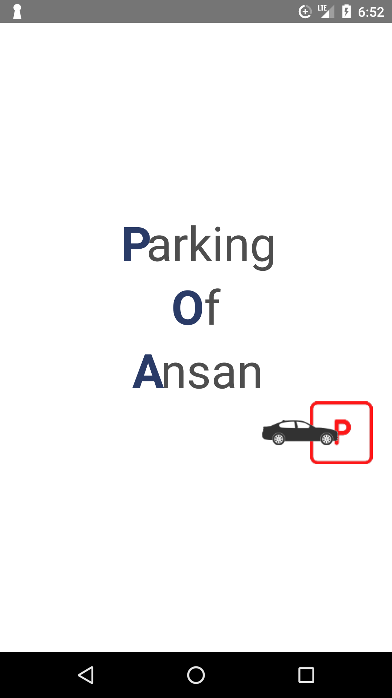
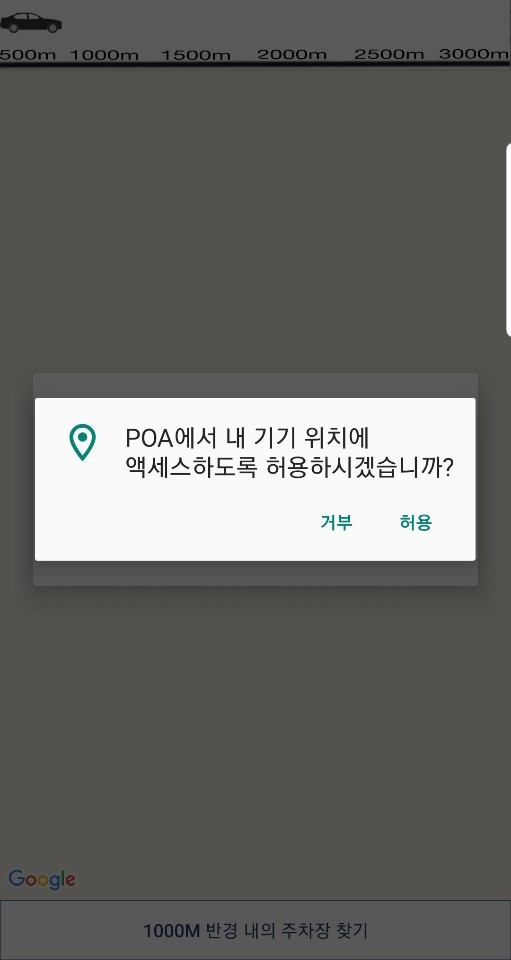
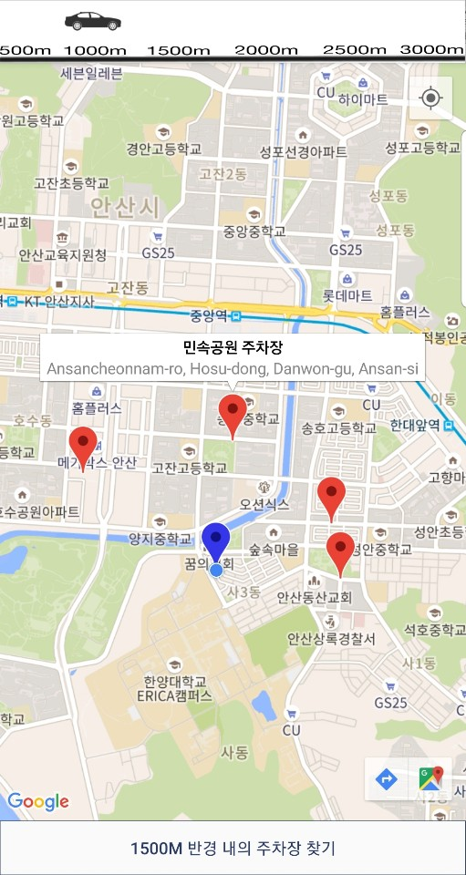

한양대학교 에리카 교내 학회 ALPA 팀프로젝트

# ParkingOfAnsan

현재 위치에서 반경(500m, 1000m, 1500m, 2000m, 2500m, 3000m)내에 위치한 공영주차장을 지도에 보여줍니다.

## Screenshots

  

## Used Library & API

- Google Map API
- Google Place API

## Goal

- 개발자와 디자이너 간의 협업 경험
- 팀 프로젝트 흐름 이해
- 개발 능력 및 디자인 능력 향상
- API 사용 경험
- Github 사용 경험
